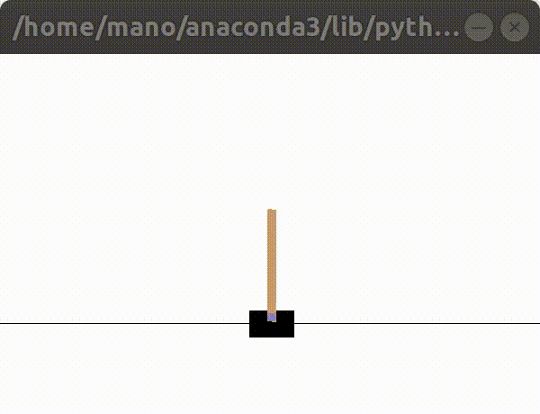

## **Qlearning cartpole agent with a neural network for estimating q values for state-action pairs**

This is a DQN approach solving the cartpole balancing problem. A simple architecture illustrated below is used to approximate the Q values for different actions given the 4 dimensional state as input

Memory-replay is used for training the network as follows,

* Initialize the memory D - (state,action,reward,next_state,done)
* Initialize the Q network with random weights
* For episode = 1, M do
	* For t, T do
		* With porbability \epsilon select a random action a, otherwise select a=argmax(Q(s,a))
		* Execute action a and get reward r, new state s' and simulation status d
		* Store transition (s,a,r,s',d) in the memory D
		* Sample a random minibatch from D
		* Set Q_target[j]=r[j] if the episode ends with action a[j], otherwise set Q_target[j]=r[j]+\gamma * max(Q(s'[j]))
		* Train the network on the batch for the set target Qs

After training, over 100 test episodes, on an average the pole stays balanced for 200 timesteps on each episode

