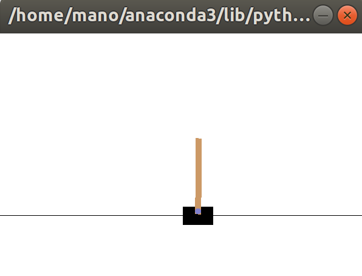
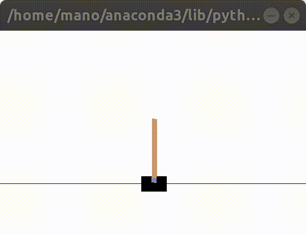

# **Qlearning cartpole agent**

This is a Q-Table approach solving the cartpole balancing problem. The envrionment provides discrete action space with 2 possible actions 0 (moves the cart to left) and 1 (moves the cart to right). The observations space is 4 dimensional **(x, x_dot, theta, theta_dot)** and continuous. 

For the Q-Table approach, the observation space is discretized. Training is done over a range of 300 episodes with decreasing exploration and learning rates.

After training, over 100 test episodes, on an average the pole stays balanced for 200 timesteps on each episode

**Next steps:**

Replace the Q-Table with a neural network that learns the Q-function for the state-action pairs